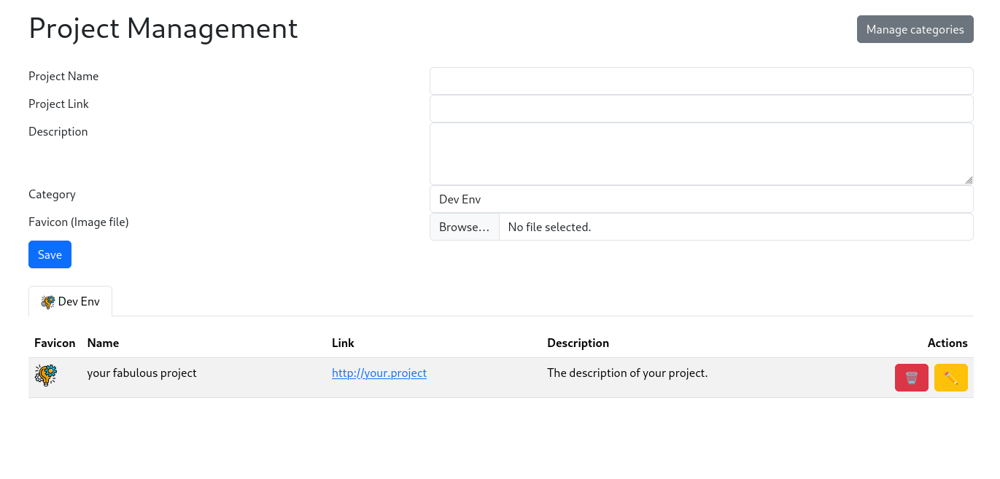

# 🛠️ StuProjectManager v0.4

## 📦 Requirements & Installation

- **PHP 8.0 or higher** (with SQLite3 extension enabled)
- **Composer** (for dependency management)

Clone the repository:

```bash
git clone https://github.com/Steform/StuProjectManager.git
cd StuProjectManager
composer install
```

Start a local PHP server (the document root must be `public/`):

```bash
php -S localhost:8000 -t public
```

Then open [http://localhost:8000](http://localhost:8000) in your browser.

- **Database**: The SQLite file (`projects.db`) is created automatically.
- **Favicon folder**: Ensure the `./public/favicon/` directory is writable (`chmod 755 public/favicon`).

## 🚀 Features
- Add, edit, and delete projects
- Organize projects by category
- **Custom display order** for categories (control the order of category tabs)
- **Custom display order** for projects (control the order of projects within each category)
- Store data in an SQLite database
- Upload and manage project and category favicons
- Automatic favicon fetching from project URLs
- Simple, accessible Bootstrap-based UI

## 💾 Backup & Restore

You can easily backup and restore all your projects, categories, and favicons using the built-in backup/restore features.

### Backup
- Click the **Backup** button at the top right of the main page.
- This will download a ZIP archive containing:
  - All projects (`projects.json`)
  - All categories (`categories.json`)
  - All favicons (in a `favicons/` folder)

### Restore
- Click the **Restore** button at the top right of the main page.
- Upload a previously downloaded backup ZIP file.
- The application will:
  - Backup your current database and favicons (with a timestamped copy)
  - Restore all projects, categories, and favicons from the ZIP
  - Automatically migrate the database schema if needed

**Note:**
- The restore operation will overwrite all current data (projects, categories, favicons) with the contents of the backup.
- If the database schema has changed, the app will auto-migrate to ensure compatibility.
- Backups are portable between different versions of the app (as long as the schema is compatible, for this version v0.2, v0.3, and v0.4 are compatible, v0.1 are not).

## 📚 Documentation (Doxygen)
This project uses [Doxygen](https://www.doxygen.nl/) to generate developer documentation from PHP docblocks.

**The documentation is not versioned in the repository. You must generate it locally.**

### Generate the documentation
```bash
doxygen
```
The documentation will be generated in the `docs/` directory.

### View the documentation
Open `docs/html/index.html` in your web browser.

You will find class, method, and file documentation for the whole PHP codebase.

## 🧪 Automated Tests

This project uses [PHPUnit](https://phpunit.de/) for automated unit testing of the models.

### Run the tests

First, install dependencies (if not already done):
```bash
composer install
```

Then, run all tests:
```bash
vendor/bin/phpunit tests/
```

You should see output indicating the number of tests and assertions.

### Test structure
- All tests are located in the `tests/` directory (e.g., `tests/models/CategoryTest.php`, `tests/models/ProjectTest.php`).
- Tests use a temporary SQLite database to avoid interfering with your real data.

## ⚠️ Database integrity

- The application enforces referential integrity using SQLite foreign key constraints.
- A project must always be linked to an existing category (via `category_id`).
- You **cannot delete a category** if there are still projects linked to it (the database will reject the operation).
- This is enforced by a `FOREIGN KEY (category_id) REFERENCES category(id) ON DELETE RESTRICT` constraint in the `projects` table.
- Automated tests verify this behavior: attempting to delete a category with linked projects will fail, and only succeeds after all related projects are deleted.

## 💡 Example usage



- Add a new project with a name, link, description, category, display order, and favicon.
- Filter projects by category using the tabs (ordered by display order).
- Projects within each category are displayed in the order specified by their display order field.
- Manage categories (add, edit, delete) via the modal dialog accessible from the main project page.
- Set custom display order for categories to control the tab order (lower numbers appear first).
- Set custom display order for projects to control their position in the list (lower numbers appear first).
- Delete or edit existing projects from the list.

### Editing workflow

- **Edit a project:**
  - Click the ✏️ button next to the project you want to edit in the project list.
  - The project form at the top of the page will switch to edit mode, pre-filled with the project data.
  - Make your changes (including display order) and click "Update". Click "Cancel" to exit edit mode.

- **Edit a category:**
  - Click the "Manage categories" button to open the modal dialog.
  - In the modal, click the ✏️ button next to the category you want to edit.
  - The category form in the modal will switch to edit mode, pre-filled with the category data.
  - Make your changes (including display order) and click "Update". Click "Cancel" to exit edit mode.

### Display order

Both categories and projects support a **display order** field that controls their position:

- **Categories**: The display order determines the order of the category tabs. Categories with lower numbers appear first (0 = first position).
- **Projects**: The display order determines the order of projects within each category. Projects with lower numbers appear first (0 = first position).
- When creating a new item, the display order defaults to 0.
- You can see the current display order of categories in the category management modal.
- The display order is preserved during backup/restore operations.

## 📋 Changelog

### v0.4 (Current)
- ✨ Added custom display order for categories (control tab order)
- ✨ Added custom display order for projects (control list order within categories)
- 🔄 Automatic database migration for existing installations
- 📦 Backups now include display order information

### v0.3
- 💾 Backup and restore functionality
- 🔄 Automatic database schema migration
- 📁 Favicon management improvements

### v0.2
- 🎨 Bootstrap-based UI
- 📂 Category management
- 🔗 Project linking to categories

### v0.1
- 🚀 Initial release
- 📝 Basic project CRUD operations
- 🗄️ SQLite database support

## 🤝 Contributing

Contributions are welcome! To contribute:

1. Fork the repository
2. Create a new branch (`git checkout -b my-feature`)
3. Make your changes and add tests if needed
4. Commit your changes (`git commit -am 'Add new feature'`)
5. Push to your fork (`git push origin my-feature`)
6. Open a Pull Request

Please ensure your code follows the existing style and passes all tests.

---

📜 License
This project is licensed under the GNU General Public License v3.0. See the LICENSE file for details.